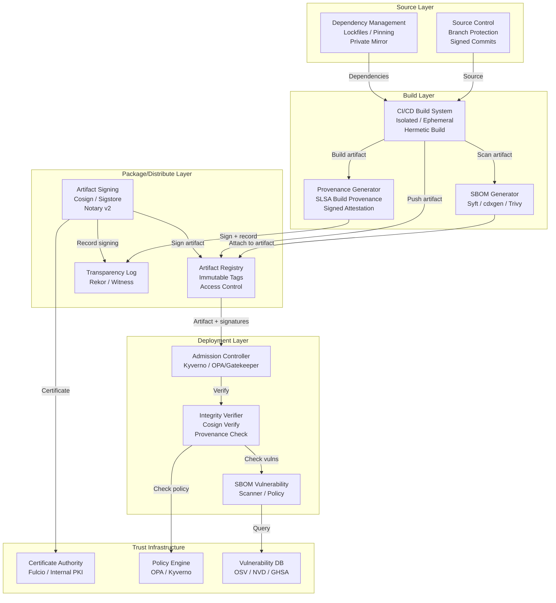
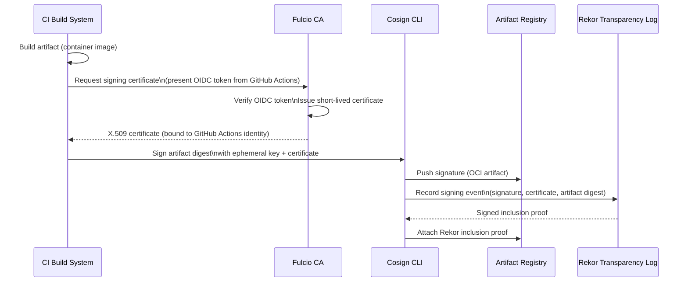
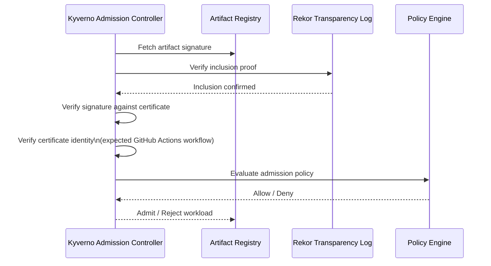
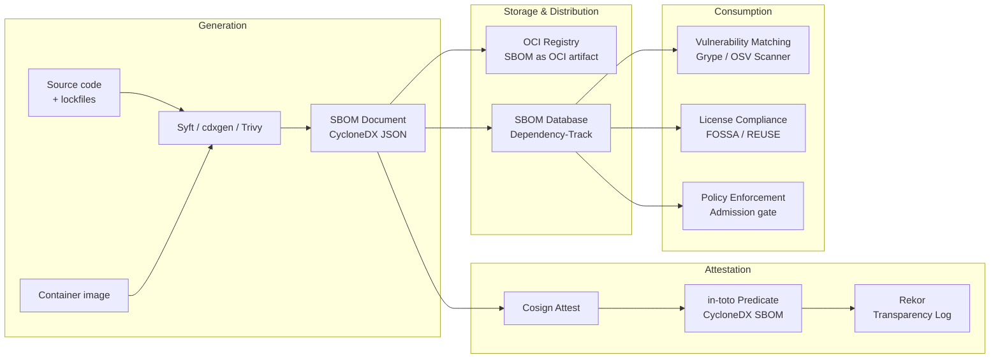
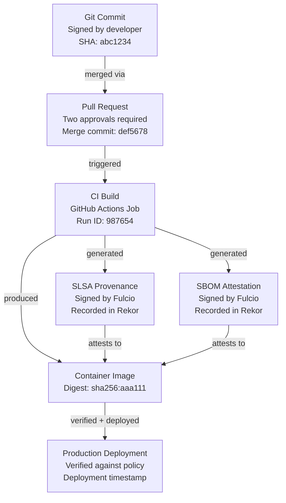
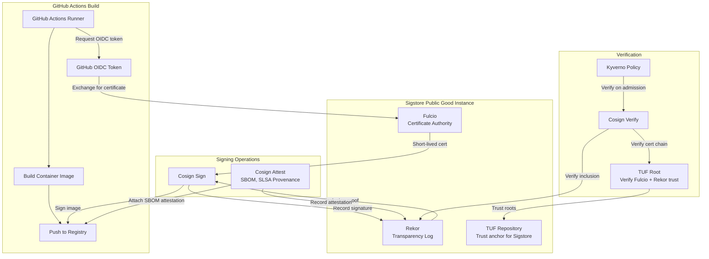

# Software Supply Chain Security Architecture

## Table of Contents

- [Architecture Overview](#architecture-overview)
- [Supply Chain Security Layers](#supply-chain-security-layers)
- [SLSA Framework Levels](#slsa-framework-levels)
- [Artifact Integrity Architecture](#artifact-integrity-architecture)
- [SBOM Architecture](#sbom-architecture)
- [Provenance Chain Architecture](#provenance-chain-architecture)
- [Registry Security Architecture](#registry-security-architecture)
- [Trust Chain Design](#trust-chain-design)
- [Sigstore/Cosign Integration Architecture](#sigstore-cosign-integration-architecture)

---

## Architecture Overview

The software supply chain security architecture defines the layered controls, verification mechanisms, and trust infrastructure required to establish cryptographic assurance from source code commit to production deployment.

### Design Principles

- **Zero implicit trust** — no artifact or build process is trusted by default. Trust must be established through cryptographic verification of provenance, signatures, and attestations at each layer.
- **Defense in depth** — security controls are applied at every layer of the supply chain (source, build, package, distribute, deploy). Compromise of any single layer should not provide end-to-end exploitation capability.
- **Verifiable provenance** — every production artifact must have a cryptographically verifiable chain of custody from its source commit to its deployed instance.
- **Policy as code** — admission and deployment decisions are driven by machine-readable, version-controlled policy that can be reviewed, audited, and continuously updated.
- **Transparency** — signing events and provenance records are published to tamper-evident transparency logs, enabling retrospective audit and anomaly detection.

### High-Level Architecture



---

## Supply Chain Security Layers

### Layer 1: Source

The source layer encompasses controls on the source code repository and contribution process.

**Key controls:**
- Branch protection rules (require reviews, status checks, no force push on protected branches)
- Signed commits (GPG, SSH key, or Sigstore Gitsign)
- Two-person review requirements for sensitive changes
- Code scanning and SAST integration in pull request checks
- Secrets scanning to prevent credential leakage into source history
- Contributor identity verification and access control

### Layer 2: Build

The build layer encompasses the CI/CD environment and build process.

**Key controls:**
- Isolated, ephemeral build environments (no persistent state between builds)
- Hermetic build isolation (no network access during build execution)
- Least-privilege build credentials (builds receive only the credentials they need)
- Build system provenance generation (SLSA provenance)
- Build system access control (who can modify pipeline definitions)
- Dependency integrity verification before build commences

### Layer 3: Package

The packaging layer encompasses artifact creation, metadata generation, and initial publication.

**Key controls:**
- SBOM generation attached to every artifact
- Artifact signing (Cosign/Sigstore) immediately after build
- Vulnerability scan of produced artifact
- Provenance attestation published to transparency log
- License compliance check

### Layer 4: Distribute

The distribution layer encompasses artifact registries and distribution infrastructure.

**Key controls:**
- Immutable artifact tags (no overwriting of published artifacts)
- Registry access control (push: CI system only; pull: authorized parties only)
- Registry-level vulnerability scanning
- Transfer layer integrity (TLS for all registry communication)
- Private registry with curated/approved external package mirror

### Layer 5: Deploy

The deployment layer is where policy enforcement occurs, verifying all upstream supply chain controls before an artifact runs in production.

**Key controls:**
- Admission control (Kyverno/OPA Gatekeeper) enforcing signature verification
- Provenance verification (artifact was built by authorized build system from authorized source)
- SBOM-based vulnerability gate (no critical vulnerabilities without approved exception)
- Image policy (approved base images only, no untrusted base layers)
- Runtime security baseline

---

## SLSA Framework Levels

SLSA defines four levels of increasing supply chain security assurance. Each level builds on the previous.

### SLSA Level 1: Provenance Exists

**Requirements:**
- Build process is documented
- Build provenance is generated and available (need not be signed)
- Provenance includes builder identity, source, and build steps

**Architecture implications:**
- CI pipeline generates a provenance document (JSON) describing the build
- Provenance is attached to the artifact (as an OCI annotation or alongside the artifact)
- No signing infrastructure required at this level

**Limitations:** SLSA 1 provenance is not signed and cannot be trusted against a compromised build system. It is primarily useful for documentation and basic transparency.

```json
// Example SLSA 1 provenance (unsigned)
{
  "_type": "https://in-toto.io/Statement/v0.1",
  "subject": [{"name": "payment-service", "digest": {"sha256": "abc123..."}}],
  "predicateType": "https://slsa.dev/provenance/v0.2",
  "predicate": {
    "builder": {"id": "https://github.com/actions/runner"},
    "buildType": "https://github.com/slsa-framework/slsa-github-generator/container@v1",
    "invocation": {
      "configSource": {
        "uri": "git+https://github.com/example/payment-service@refs/heads/main",
        "digest": {"sha1": "def456..."},
        "entryPoint": ".github/workflows/build.yml"
      }
    },
    "buildConfig": {},
    "metadata": {
      "buildStartedOn": "2024-03-15T14:00:00Z",
      "buildFinishedOn": "2024-03-15T14:12:34Z",
      "completeness": {"parameters": true, "environment": false, "materials": true}
    },
    "materials": [{"uri": "git+https://github.com/example/payment-service", "digest": {"sha1": "def456..."}}]
  }
}
```

### SLSA Level 2: Hosted Build, Signed Provenance

**Requirements:**
- Build is run on a hosted build service (GitHub Actions, Google Cloud Build, GitLab CI)
- Provenance is generated by the build service and cryptographically signed
- Source is version controlled

**Architecture implications:**
- Signing infrastructure required (Sigstore Fulcio, or internal PKI)
- Signing keys are controlled by the build service, not the developer
- Consumers must verify provenance signatures before trusting artifacts

**What SLSA 2 protects against:** An attacker who can modify developer workstations or local build scripts cannot forge valid provenance — provenance is generated and signed by the hosted build service.

**Limitations:** Does not protect against compromise of the build service itself (e.g., malicious pipeline configuration changes).

### SLSA Level 3: Hardened Build Platform

**Requirements:**
- Build platform is specifically designed to generate non-falsifiable provenance
- Build environment is isolated — no cross-build contamination
- Build is auditable — full build logs retained and protected
- Provenance is verifiably produced by the platform (not just the pipeline configuration)

**Architecture implications:**
- Build platform must enforce isolation (ephemeral runners, no shared state)
- Provenance must be generated outside the reach of the build definition (cannot be forged by pipeline YAML changes)
- GitHub Actions with SLSA GitHub Generator satisfies SLSA 3 for container images
- Tekton Chains on Kubernetes provides SLSA 3 provenance for Kubernetes-native builds

**What SLSA 3 protects against:** An attacker who can modify the build pipeline configuration (e.g., CI YAML files) cannot forge valid SLSA 3 provenance — the provenance is generated by the platform, not the pipeline definition.

### SLSA Level 4: Hermetic, Reproducible Builds

**Requirements:**
- All build inputs are declared and fetched before build begins (hermetic)
- Build is reproducible — same inputs produce bit-for-bit identical output
- Two-person review required for all source changes (four-eyes principle)
- Build system is internally audited

**Architecture implications:**
- Requires purpose-built build systems (Bazel, BuildStream, or custom hermetic environments)
- Dependencies must be fetched from controlled, hash-pinned sources
- Build environment must be fully specified and reproducible
- Significant investment in build system engineering

**What SLSA 4 protects against:** Even a compromised build machine — where an attacker can inject code during the build — cannot produce a valid SLSA 4 artifact without detection, because independent rebuilds from the same source will produce different output.

**Practical note:** SLSA 4 is the most demanding level and is appropriate for the most critical software components. Most organizations should target SLSA 3 as their primary objective.

---

## Artifact Integrity Architecture

### Signing Architecture



### Verification Architecture



---

## SBOM Architecture

### SBOM Generation and Lifecycle



### CycloneDX SBOM Structure

```json
{
  "bomFormat": "CycloneDX",
  "specVersion": "1.5",
  "serialNumber": "urn:uuid:3e671687-395b-41f5-a30f-a58921a69b79",
  "version": 1,
  "metadata": {
    "timestamp": "2024-03-15T14:12:34Z",
    "tools": [{"vendor": "anchore", "name": "syft", "version": "1.0.1"}],
    "component": {
      "type": "container",
      "name": "payment-service",
      "version": "2.14.0",
      "purl": "pkg:oci/payment-service@sha256:abc123...?repository_url=registry.example.com",
      "hashes": [{"alg": "SHA-256", "content": "abc123..."}]
    }
  },
  "components": [
    {
      "type": "library",
      "name": "spring-boot-starter-web",
      "version": "3.2.3",
      "purl": "pkg:maven/org.springframework.boot/spring-boot-starter-web@3.2.3",
      "licenses": [{"license": {"id": "Apache-2.0"}}],
      "hashes": [{"alg": "SHA-256", "content": "def456..."}],
      "externalReferences": [
        {"type": "website", "url": "https://spring.io/projects/spring-boot"},
        {"type": "vcs", "url": "https://github.com/spring-projects/spring-boot"}
      ]
    }
  ],
  "vulnerabilities": [],
  "dependencies": [
    {
      "ref": "pkg:oci/payment-service@sha256:abc123...",
      "dependsOn": ["pkg:maven/org.springframework.boot/spring-boot-starter-web@3.2.3"]
    }
  ]
}
```

### SBOM Format Comparison

| Dimension | CycloneDX | SPDX |
|---|---|---|
| **Governing body** | OWASP | Linux Foundation (ISO/IEC 5962) |
| **Primary formats** | JSON, XML, Protobuf | JSON-LD, YAML, RDF, Tag-Value |
| **Security focus** | Strong (VEX, vulnerability data) | Moderate |
| **License focus** | Good | Excellent (historical strength) |
| **Tooling ecosystem** | Broad | Broad |
| **Automation suitability** | Excellent (JSON native) | Good |
| **EO 14028 / NTIA** | Compliant | Compliant |
| **Recommended for** | Security-first SBOM use cases | License compliance, legal review |

---

## Provenance Chain Architecture

The provenance chain links every production artifact to its source commit through a series of cryptographically signed statements.



### Provenance Verification at Deployment

Before admitting an artifact to a production namespace, the admission controller verifies the complete provenance chain:

1. **Artifact signature** — the container image has a valid Cosign signature from an authorized signer identity
2. **SLSA provenance attestation** — a valid SLSA provenance attestation exists, signed by the CI system
3. **Source integrity** — the provenance attests that the artifact was built from the expected source repository and branch
4. **Build system identity** — the provenance was produced by the authorized CI/CD system (verified via Fulcio certificate identity constraints)
5. **SBOM attestation** — a valid SBOM attestation exists for the artifact
6. **Vulnerability policy** — the SBOM-based vulnerability scan result is within policy (no critical vulnerabilities without exception)

---

## Registry Security Architecture

### Registry Access Control Model

```
Artifact Registry
├── Push access
│   └── CI/CD system service account (robot account, OIDC workload identity)
│   └── Platform engineers (emergency break-glass only, always logged)
│
├── Pull access
│   ├── Production Kubernetes clusters (OIDC workload identity or robot account)
│   ├── Staging Kubernetes clusters
│   ├── Developers (pull for local debugging — read only, not production images)
│   └── Admission controller (for signature verification)
│
└── Admin access
    └── Platform security team only (MFA required, all actions logged)
```

### Vulnerability Scanning in Registry

Registries should be configured to scan images on push and periodically re-scan stored images against updated vulnerability databases:

```yaml
# Harbor robot account and scan policy
scan_policy:
  auto_scan: true
  scan_on_push: true
  scan_schedule: "0 2 * * *"  # Daily at 2 AM UTC

vulnerability_policy:
  action: prevent  # Block pull if vulnerability threshold exceeded
  severity: CRITICAL
  allowlist:
    - id: "CVE-2023-12345"
      expires_at: "2024-06-01"
      reason: "Vendor patch pending; mitigated by network controls"
```

---

## Trust Chain Design

The trust chain defines how trust is established and delegated from a root of trust down through the supply chain layers.

### Trust Root Options

| Root of Trust | Characteristics | Recommended Use |
|---|---|---|
| **Sigstore Public Good Instance** | Free, public, transparent; certificates tied to OIDC identities | Open source projects; organizations starting with supply chain security |
| **Private Sigstore instance** | Self-hosted Fulcio + Rekor; full control; private transparency log | Regulated industries; sensitive internal software |
| **Internal PKI (Enterprise CA)** | Traditional X.509 certificate hierarchy; existing investment; offline root | Organizations with existing PKI; air-gapped environments |
| **Hardware Security Module (HSM)** | Highest assurance; physical protection for signing keys | Extremely sensitive artifacts; regulated high-assurance environments |

### Certificate Identity Constraints

When verifying artifact signatures, consumers specify the expected identity of the signer. For keyless Sigstore signing from GitHub Actions:

```bash
cosign verify \
  --certificate-identity-regexp "^https://github.com/example-org/payment-service/.github/workflows/build.yml@refs/heads/main$" \
  --certificate-oidc-issuer "https://token.actions.githubusercontent.com" \
  registry.example.com/payment-service:sha256-abc123...
```

This verification ensures that the artifact was signed by a GitHub Actions workflow in the specific repository, on the specific branch — providing strong source and build system provenance assurance.

---

## Sigstore/Cosign Integration Architecture

### Full Sigstore Integration



### Cosign Usage Patterns

**Signing a container image (keyless, GitHub Actions):**
```bash
# In GitHub Actions workflow
- name: Sign container image
  run: |
    cosign sign --yes \
      registry.example.com/payment-service@${{ steps.build.outputs.digest }}
  env:
    COSIGN_EXPERIMENTAL: "true"  # Enables keyless signing
```

**Attaching an SBOM attestation:**
```bash
- name: Generate SBOM
  run: syft registry.example.com/payment-service@$DIGEST -o cyclonedx-json > sbom.json

- name: Attest SBOM
  run: |
    cosign attest --yes \
      --predicate sbom.json \
      --type cyclonedx \
      registry.example.com/payment-service@${{ steps.build.outputs.digest }}
```

**Verifying artifact signature (at deployment):**
```bash
cosign verify \
  --certificate-identity "https://github.com/example-org/payment-service/.github/workflows/build.yml@refs/heads/main" \
  --certificate-oidc-issuer "https://token.actions.githubusercontent.com" \
  registry.example.com/payment-service:sha256-abc123...
```

**Kyverno policy to enforce signature verification:**
```yaml
apiVersion: kyverno.io/v1
kind: ClusterPolicy
metadata:
  name: require-signed-images
spec:
  validationFailureAction: Enforce
  background: false
  rules:
    - name: check-image-signature
      match:
        any:
          - resources:
              kinds: [Pod]
              namespaces: [production, staging]
      verifyImages:
        - imageReferences: ["registry.example.com/*"]
          attestors:
            - count: 1
              entries:
                - keyless:
                    subject: "https://github.com/example-org/*/github/workflows/build.yml@refs/heads/main"
                    issuer: "https://token.actions.githubusercontent.com"
                    rekor:
                      url: https://rekor.sigstore.dev
```
